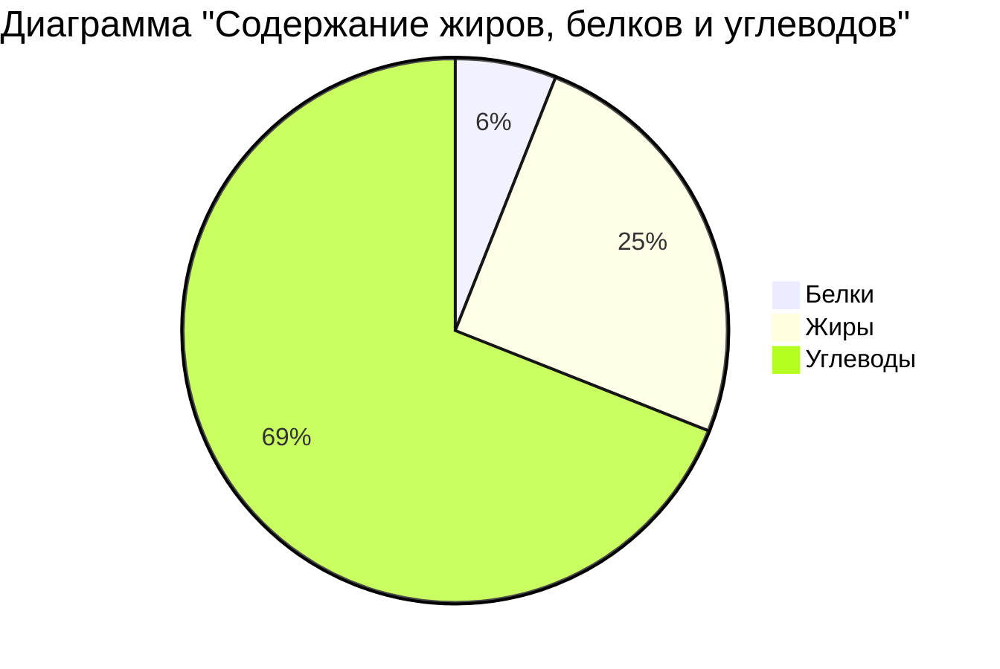

> **"Не красна изба углами, а красна пирогами"**  
> *(Русская пословица)*
# Пирог с яблоками
### `Ингредиенты`
#### Для теста:

-	200 г сливочного масла
-	150 г сахара
-	3 яйца
-	300 г муки
-	1 ч. л. разрыхлителя
-	щепотка соли
 
#### Для начинки:
-	800 г яблок 
-	80 г сахара
-	1 ч. л. корицы 
- 1 ст. л. крахмала
  

### **Способ приготовления**
**1.**	Подготовьте яблоки. Вымойте фрукты. Нарежьте яблоки тонкими дольками. Смешайте с сахаром и корицей. Добавьте крахмал. \
**2.**	Замесите тесто. Размягчённое масло взбейте с сахаром до пышности. По одному добавьте яйца, после каждого снова взбивая массу. Просейте муку с разрыхлителем. Постепенно введите сухую смесь в масляно-яичную массу, аккуратно перемешивая лопаткой. \
**3.**	Соберите пирог. Смажьте форму маслом и слегка присыпьте мукой. Выложите примерно ⅔ теста в форму, разровняйте и сделайте небольшие бортики по краям. Распределите яблочную начинку ровным слоем. Сверху выложите оставшееся тесто небольшими порциями. \
**4.**	Выпекайте. Разогрейте духовку до 180 °C. Поставьте пирог и выпекайте примерно 40–45 минут до золотистой корочки. 

---------------

### **`Несколько советов`**
- [x]  Используйте яйца комнатной температуры — так выпечка получится пышнее.
- [x] 	Не открывайте духовку в первые 25–30 минут: из-за перепада температур тесто может осесть.
- [x] 	Если верх быстро подгорает, а середина ещё сырая — накройте форму фольгой и продолжайте выпекать.
- [x] 	Остывший пирог лучше держит форму и легче нарезается.
      
**Таблица расчета калорийности яблочного пирога**
|Продукт|Жиры, г|Белки, г|Углеводы, г|ккал/100 г|
|:----- |:--:|:---:|:------:|---------:|
|Масло сливочное|82|0,5|0,8|600|
|Сахар|0|0|99,9|800|
|Яйцо|10,5|12,6|0,7|150|
|Мука|1,1|10,3|68,9|334|
|Соль|0|0|0|0|
|Яблоки|0,4|0,4|9,8|47|
|Крахмал|0,1|0,1|79|317|

 
